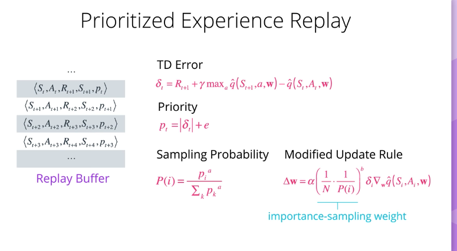
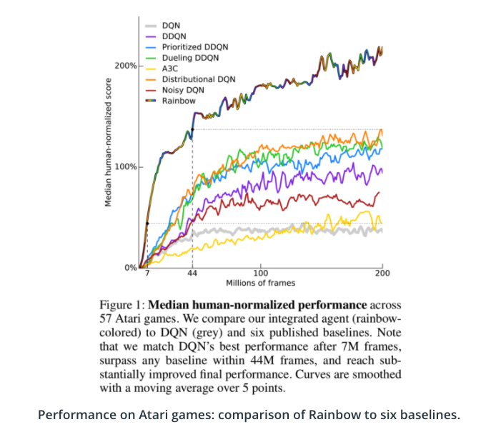

# Deep Q-Networks
the Deep Q-Learning algorithm represents the optimal action-value function q* as a neural network (instead of a table)
## Atari DQN
- preprocessing: square image, grey scale, stacking 4 frames in a sequence as input,
- output: instead of prediction one Q value at a time, it produce a Q value for every possible action in a single forward pass.
- arch: conv layer(Relo) + FC(Relu) + FC

## Stabilizing Deep Reinforcement Learning
[Issues in Using Function Approximation for Reinforcement Learning](http://citeseerx.ist.psu.edu/viewdoc/download?doi=10.1.1.73.3097&rep=rep1&type=pdf)

Unfortunately, reinforcement learning is notoriously unstable when neural networks are used to represent the action values. In this lesson, you'll learn all about the Deep Q-Learning algorithm, which addressed these instabilities by using two key features:
- Experience Replay:
  - When the agent interacts with the environment, the sequence of experience tuples can be highly correlated. The naive Q-learning algorithm that learns from each of these experience tuples in sequential order runs the risk of getting swayed by the effects of this correlation. By instead keeping track of a replay buffer and using experience replay to sample from the buffer at random, we can prevent action values from oscillating or diverging catastrophically.

- The replay buffer contains a collection of experience tuples (S, A, R, S'). The tuples are gradually added to the buffer as we are interacting with the environment.

- The act of sampling a small batch of tuples from the replay buffer in order to learn is known as experience replay. In addition to breaking harmful correlations, experience replay allows us to learn more from individual tuples multiple times, recall rare occurrences, and in general make better use of our experience.
- Fixed Q-Targets

### Readings
  - Riedmiller, Martin. "Neural fitted Q iteration–first experiences with a data efficient neural reinforcement learning method." European Conference on Machine Learning. Springer, Berlin, Heidelberg, 2005. http://ml.informatik.uni-freiburg.de/former/_media/publications/rieecml05.pdf

  - Mnih, Volodymyr, et al. "Human-level control through deep reinforcement learning." Nature518.7540 (2015): 529. http://www.davidqiu.com:8888/research/nature14236.pdf
## DQN in Artari Paper
[Human-level control through deep reinforcement
learning](https://storage.googleapis.com/deepmind-media/dqn/DQNNaturePaper.pdf)
- In order to capture temporal information, a stack of 4 preprocessed frames are used as the state that is passed to the DQN.
- The DQN takes the state as input, and returns the corresponding predicted action values for each possible game action.
- The DQN architecture is composed of a couple of convolutional layers, followed by a couple of fully connected layers.
- For each Atari game, the DQN was trained from scratch on that game.

## Experience Replay
The replay buffer contains a collection of experience tuples (S, A, R, S'). The tuples are gradually added to the buffer as we are interacting with the environment.
  (what I understand is it break the online experience only, more like offline experience where more sampling techniques can be applied.)
- When the agent interacts with the environment, the sequence of experience tuples can be highly correlated. The naive Q-learning algorithm that learns from each of these experience tuples in sequential order runs the risk of getting swayed by the effects of this correlation. By instead keeping track of a replay buffer and using experience replay to sample from the buffer at random, we can prevent action values from oscillating or diverging catastrophically.
- In addition to breaking harmful correlations, experience replay allows us to learn more from individual tuples multiple times, recall rare occurrences, and in general make better use of our experience.
## Fixed Target
In Q-Learning, we update a guess with a guess, and this can potentially lead to harmful correlations. To avoid this, we can update the parameters ww in the network q^to better approximate the action value corresponding to state SS and action AA with the following update rule

- The Deep Q-Learning algorithm uses two separate networks with identical architectures.
- The target Q-Network's weights are updated less often (or more slowly) than the primary Q-Network.
- Without fixed Q-targets, we would encounter a harmful form of correlation, whereby we shift the parameters of the network based on a constantly moving target.
## Deep Q-Learning Algorithm
[ research paper that introduces the Deep Q-Learning algorithm.](https://storage.googleapis.com/deepmind-media/dqn/DQNNaturePaper.pdf)

[How to Read and Understand a Scientific Paper](https://www.huffpost.com/entry/how-to-read-and-understand-a-scientific-paper_b_5501628)

[How to read and understand a scientific paper: a guide for non-scientists](https://violentmetaphors.com/2013/08/25/how-to-read-and-understand-a-scientific-paper-2/)
- Take notes.

- Read the paper multiple times. On the first couple readings, try to focus on the main points:

  - What kind of tasks are the authors using deep reinforcement learning (RL) to solve? What are the states, actions, and rewards?
  - What neural network architecture is used to approximate the action-value function?
  - How are experience replay and fixed Q-targets used to stabilize the learning algorithm?
  - What are the results?
- Understanding the paper will probably take you longer than you think. Be patient, and reach out to the Udacity community with any questions.

## Double Q-Learning [Paper](https://arxiv.org/abs/1509.06461)
[Issues in Using Function Approximation for Reinforcement Learning](https://www.ri.cmu.edu/pub_files/pub1/thrun_sebastian_1993_1/thrun_sebastian_1993_1.pdf)

Deep Q-Learning tends to overestimate action values. Double Q-Learning has been shown to work well in practice to help with this.
- to estimate action with max Q-value, the accuracy depends a lot on what has been tried and what neighboring state has been explored. This can result in an overestimation since we always pick the maximum among a set of noisy numbers.
- double Q: select the best action using one set of parameters w , but evaluate it(get value for TD target) using a different set of parameters w'. like have two set of function approximators that must agree on the best action: if w picks an action that is not the best according to w', then the Q value returned is not that high. in the long run, this prevents algorithm from propogating incidental high reward that may have been obtained by chance but don't reflect long term returns,
- in implementation, can use the frozen w for evaluation only.

## Prioritized Experience Replay [Paper](https://arxiv.org/abs/1511.05952)
Deep Q-Learning samples experience transitions uniformly from a replay memory. Prioritized experienced replay is based on the idea that the agent can learn more effectively from some transitions than from others, and the more important transitions should be sampled with higher probability.

## Dueling DQN
[Dueling Network Architectures for Deep Reinforcement Learning](https://arxiv.org/abs/1511.06581)

Currently, in order to determine which states are (or are not) valuable, we have to estimate the corresponding action values for each action. However, by replacing the traditional Deep Q-Network (DQN) architecture with a dueling architecture, we can assess the value of each state, without having to learn the effect of each action.

## More extensions to DQN
Each of the six extensions address a different issue with the original DQN algorithm.
- Learning from multi-step bootstrap targets - [Asynchronous Methods for Deep Reinforcement Learning](https://arxiv.org/abs/1602.01783)
- Distributional DQN - [A Distributional Perspective on Reinforcement Learning](https://arxiv.org/abs/1707.06887)
- Noisy DQN - [Noisy Networks for Exploration](https://arxiv.org/abs/1706.10295)

Researchers at Google DeepMind recently tested the performance of an agent that incorporated all six of these modifications. The corresponding algorithm was termed Rainbow - [Rainbow: Combining Improvements in Deep Reinforcement Learning](https://arxiv.org/abs/1710.02298)

