The details of PPO was originally published by the team at OpenAI:  [Paper-Proximal Policy Optimization Algorithms](https://arxiv.org/abs/1707.06347)
State-of-the-art RL algorithms contain many important tweaks in addition to simple value-based or policy-based methods. One of these key improvements is called Proximal Policy Optimization (PPO) -- also closely related to Trust Region Policy Optimization (TRPO). It has allowed faster and more stable learning. From developing agile robots, to creating expert level gaming AI, PPO has proven useful in a wide domain of applications, and has become part of the standard toolkits in complicated learning environments.

### Noise Reduction
gradients are noisy in REINFORCE. typicalling there are over millions of trajectories and infinite for continous problems. So for practical purpose, simply take one trajectory and update the gradiet. So this simply comes to chance.
A simple solution is to use more trajectories.
- Rewards Normalization: Also by collecting all rewards, and get a sense of how they are distributed. the distribution of rewards shift as learning happens, an episode may seem to have good reward early in training, but really bad after 1000 training episodes.  So normalizing rewards can have better performance:
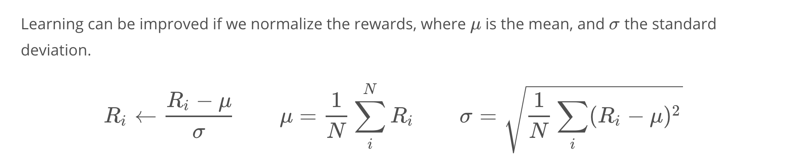
(when all the R_i are the same, σ=0, we can set all the normalized rewards to 0 to avoid numerical problems)
- This batch-normalization technique is also used in many other problems in AI (e.g. image classification), where normalizing the input can improve learning.

- Intuitively, normalizing the rewards roughly corresponds to picking half the actions to encourage/discourage, while also making sure the steps for gradient ascents are not too large/small.

### Credit Assignment
at time-step tt. Even before an action is decided, the agent has already received all the rewards up until step t-1t−1. So we can think of that part of the total reward as the reward from the past. The rest is denoted as the future reward.

Because we have a Markov process, the action at time-step tt can only affect the future reward, so the past reward shouldn’t be contributing to the policy gradient. So to properly assign credit to the action a_t, we should ignore the past reward. So a better policy gradient would simply have the future reward as the coefficient .
- Notes on Gradient Modification
You might wonder, why is it okay to just change our gradient? Wouldn't that change our original goal of maximizing the expected reward?

It turns out that mathematically, ignoring past rewards might change the gradient for each specific trajectory, but it doesn't change the averaged gradient. So even though the gradient is different during training, on average we are still maximizing the average reward. In fact, the resultant gradient is less noisy, so training using future reward should speed things up!

## Importance sampling
- problem: Let’s go back to the REINFORCE algorithm. We start with a policy, then using that policy, we generate a trajectory (or multiple ones to reduce noise) . Afterward, we compute a policy gradient, gg, and update

At this point, the trajectories we’ve just generated are simply thrown away. If we want to update our policy again, we would need to generate new trajectories once more, using the updated policy.

You might ask, why is all this necessary? It’s because we need to compute the gradient for the current policy, and to do that the trajectories need to be representative of the current policy.

But this sounds a little wasteful. What if we could somehow recycle the old trajectories, by modifying them so that they are representative of the new policy? So that instead of just throwing them away, we recycle them!

Then we could just reuse the recycled trajectories to compute gradients, and to update our policy, again, and again. This would make updating the policy a lot more efficient. So, how exactly would that work?
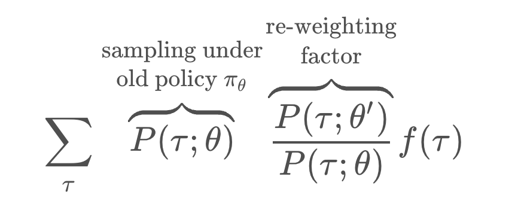
ntuitively, this tells us we can use old trajectories for computing averages for new policy, as long as we add this extra re-weighting factor, that takes into account how under or over–represented each trajectory is under the new policy compared to the old one.

The same tricks are used frequently across statistics, where the re-weighting factor is included to un-bias surveys and voting predictions.
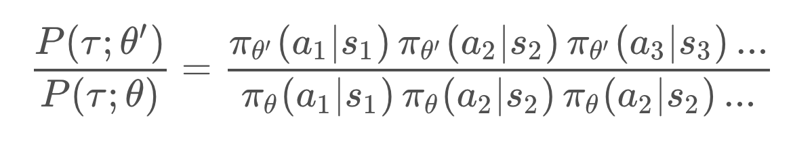
Because each trajectory contains many steps, the probability contains a chain of products of each policy at different time-step.

This formula is a bit complicated. But there is a bigger problem. When some of policy gets close to zero, the re-weighting factor can become close to zero, or worse, close to 1 over 0 which diverges to infinity.

When this happens, the re-weighting trick becomes unreliable. So, In practice, we want to make sure the re-weighting factor is not too far from 1 when we utilize importance sampling

## PPO Surrogate function

### Re-weighting the Policy Gradient
Suppose we are trying to update our current policy, π_θ',. To do that, we need to estimate a gradient, gg. But we only have trajectories generated by an older policy π_θ How do we compute the gradient then? We can rearrange these equations, and the re-weighting factor is just the product of all the policy across each step -- I’ve picked out the terms at time-step tt here. We can cancel some terms, but we're still left with a product of the policies at different times
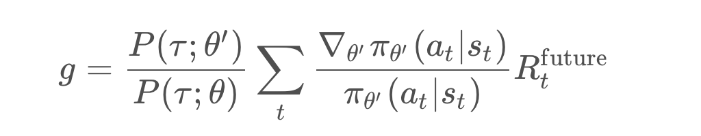

Can we simplify this expression further? This is where proximal policy comes in. If the old and current policy is close enough to each other, all the factors inside the "......" would be pretty close to 1, and then we can ignore them.
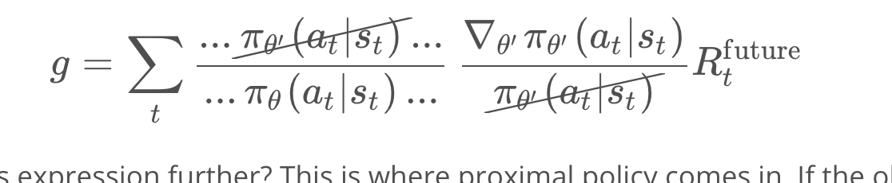

Mathematically, we could utilize importance sampling. The answer just what a normal policy gradient would be, times a re-weighting factor
using importance sampling, we have the approximate form of the gradient, we can think of it as the gradient of a new object, called the surrogate function. So using this new gradient, we can perform gradient ascent to update our policy -- which can be thought as directly maximize the surrogate function.
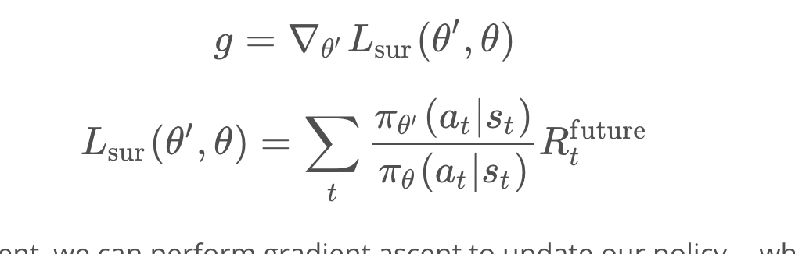

But there is still one important issue we haven’t addressed yet. If we keep reusing old trajectories and updating our policy, at some point the new policy might become different enough from the old one, so that all the approximations we made could become invalid.

We need to find a way make sure this doesn’t happen

## PPO Part 2: Clipping Policy Updates
### The Policy/Reward Cliff
What is the problem with updating our policy and ignoring the fact that the approximations are not valid anymore? One problem is it could lead to a really bad policy that is very hard to recover from. This shows how the estimation can diverge from the real reward using inaccurate approximation.
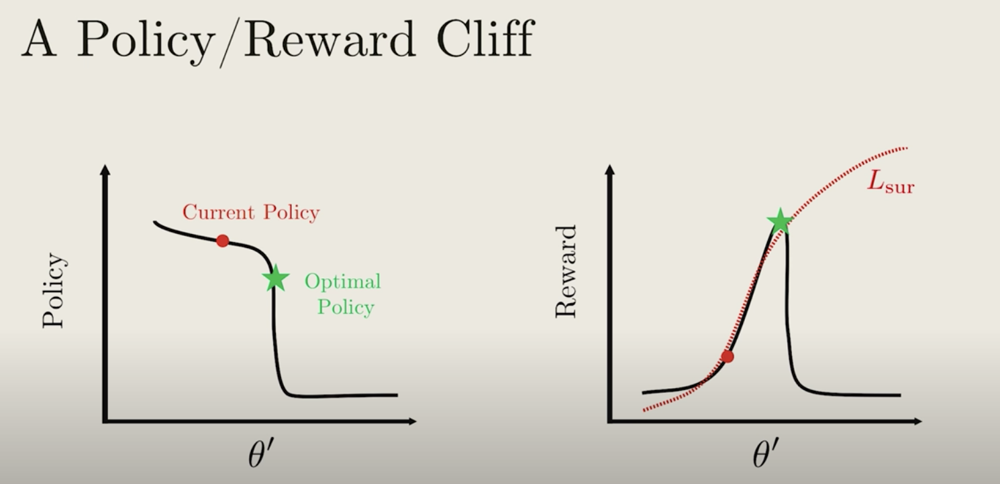

Say we have some policy parameterized by π_θ' (shown on the left plot in black), and with an average reward function (shown on the right plot in black).

The current policy is labelled by the red text, and the goal is to update the current policy to the optimal one (green star). To update the policy we can compute a surrogate function L_sur (dotted-red curve on right plot). So L_sur approximates the reward pretty well around the current policy. But far away from the current policy, it diverges from the actual reward.

If we continually update the policy by performing gradient ascent, we might get something like the red-dots. The big problem is that at some point we hit a cliff, where the policy changes by a large amount. From the perspective of the surrogate function, the average reward is really great. But the actually average reward is really bad!

What’s worse, the policy is now stuck in a deep and flat bottom, so that future updates won’t be able to bring the policy back up! we are now stuck with a really bad policy.

How do we fix this? Wouldn’t it be great if we can somehow stop the gradient ascent so that our policy doesn’t fall off the cliff?

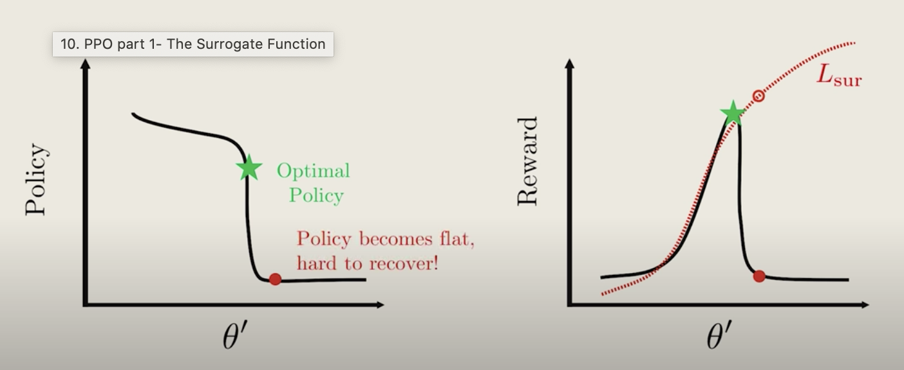

### solution
So starting with the current policy (blue dot), we apply gradient ascent. The updates remain the same, until we hit the flat plateau. Now because the reward function is flat, the gradient is zero, and the policy update will stop!.
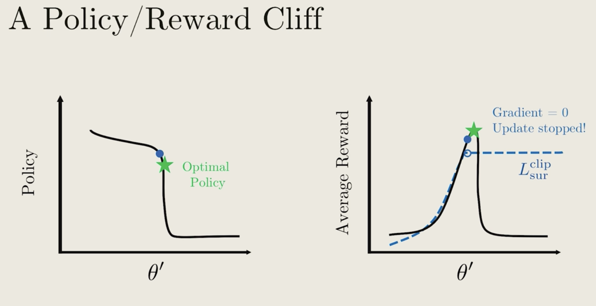
This shows the original point where two polciy are the same so the ratio=1
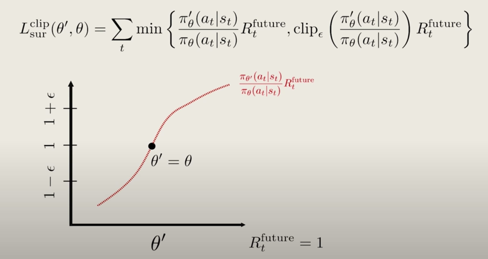
We want to make sure the two policy is similar, or that the ratio is close to 1. So we choose a small \epsilonϵ (typically 0.1 or 0.2), and apply the {\rm clip}clip function to force the ratio to be within the interval [1−ϵ,1+ϵ] (shown in purple).
but we only need to clip the top not the bottom
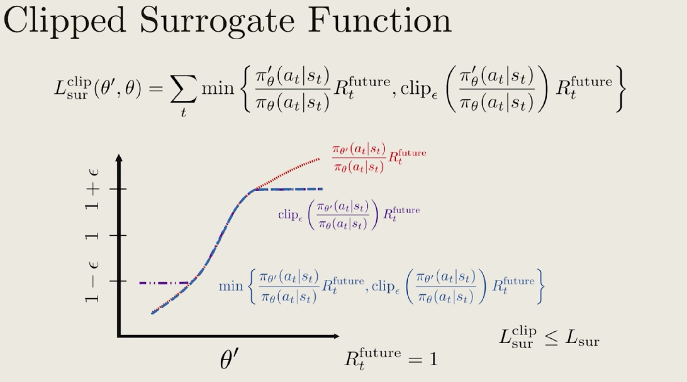

# PPO algorithm

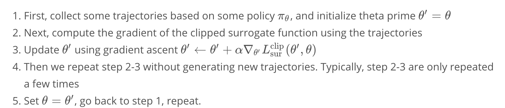
