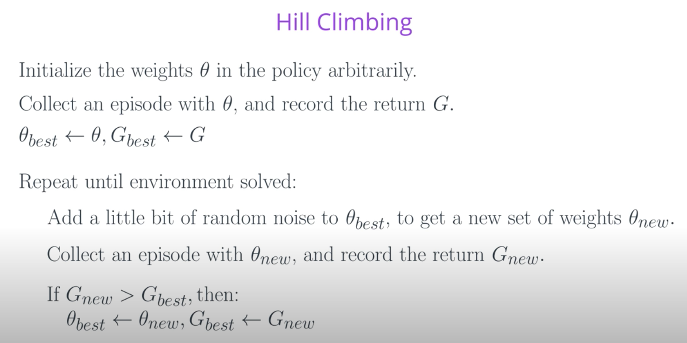
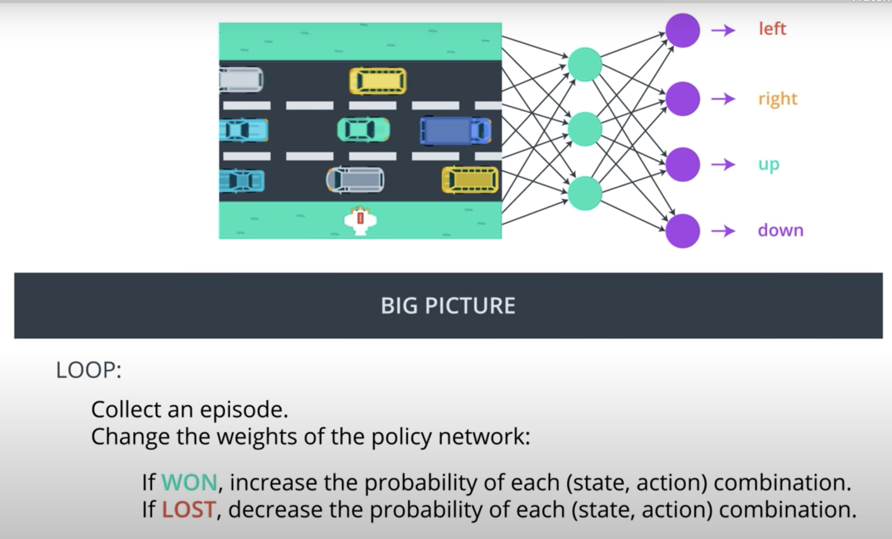
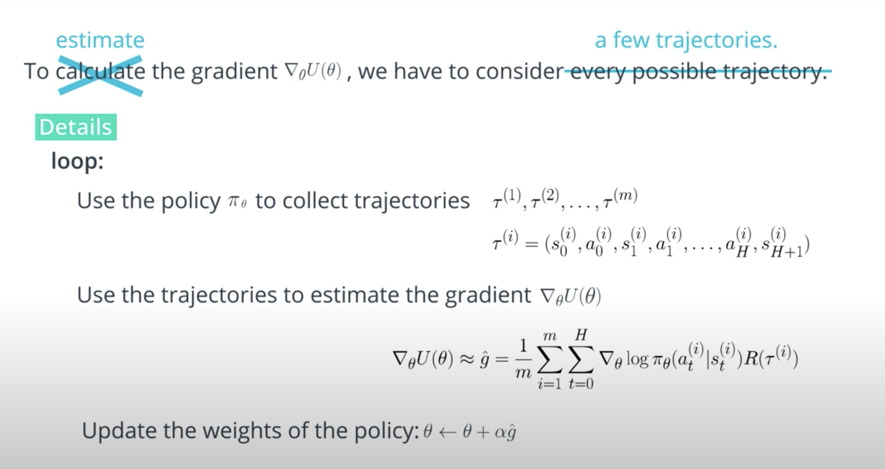
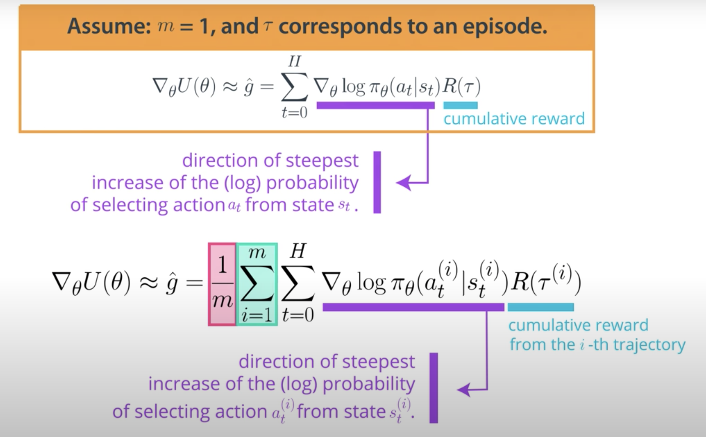
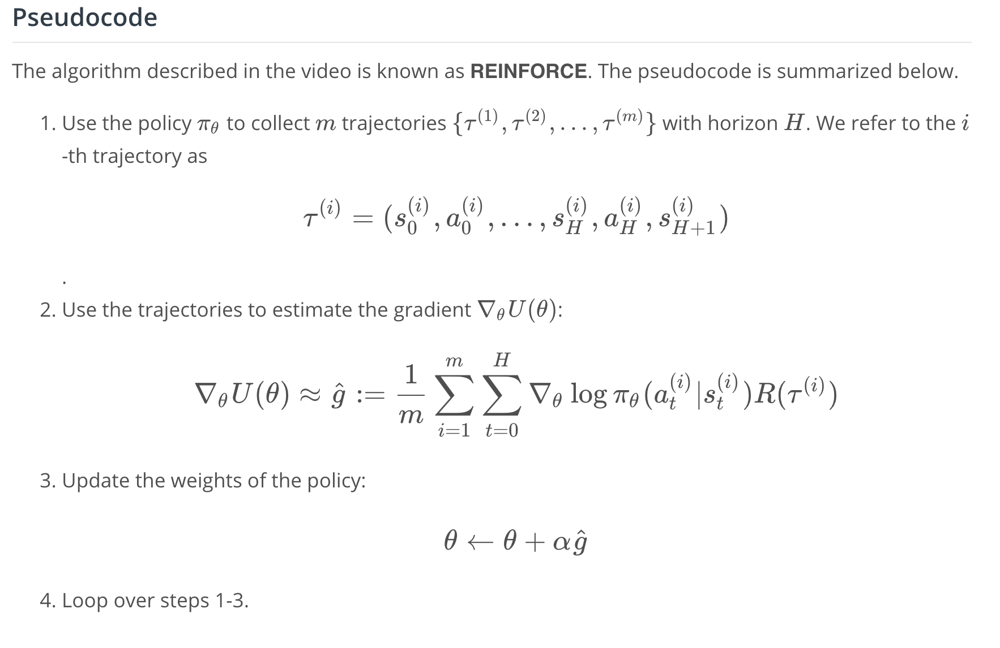

## Policy Function Approximation
- In deep reinforcement learning, it is common to represent the policy with a neural network.
  - This network takes the environment state as input.
  - If the environment has discrete actions, the output layer has a node for each possible action and contains the probability that the agent should select each possible action.
- The weights in this neural network are initially set to random values. Then, the agent updates the weights as it interacts with (and learns more about) the environment.
- Policy-based methods can learn either stochastic or deterministic policies, and they can be used to solve environments with either finite or continuous action spaces.
## Hill Climbing
Hill climbing is an iterative algorithm that can be used to find the weights \thetaθ for an optimal policy.
At each iteration,
We slightly perturb the values of the current best estimate for the weights theta_best, to yield a new set of weights.
These new weights are then used to collect an episode. If the new weights θ_new
resulted in higher return than the old weights, then we set θ_best←θ_new
## Beyond Hill Climbing
- Steepest ascent hill climbing is a variation of hill climbing that chooses a small number of neighboring policies at each iteration and chooses the best among them.
- Simulated annealing uses a pre-defined schedule to control how the policy space is explored, and gradually reduces the search radius as we get closer to the optimal solution.
- Adaptive noise scaling decreases the search radius with each iteration when a new best policy is found, and otherwise increases the search radius.
- The cross-entropy method iteratively suggests a small number of neighboring policies, and uses a small percentage of the best performing policies to calculate a new estimate.
- The evolution strategies technique considers the return corresponding to each candidate policy. The policy estimate at the next iteration is a weighted sum of all of the candidate policies, where policies that got higher return are given higher weight.

## Why Policy-Based Methods?
There are three reasons why we consider policy-based methods:
Simplicity: Policy-based methods directly get to the problem at hand (estimating the optimal policy), without having to store a bunch of additional data (i.e., the action values) that may not be useful.
Stochastic policies: Unlike value-based methods, policy-based methods can learn true stochastic policies.
Continuous action spaces: Policy-based methods are well-suited for continuous action spaces.
- In addition to the practical advantages of policy parameterization over "-greedy action
selection, there is also an important theoretical advantage. With continuous policy
parameterization the action probabilities change smoothly as a function of the learned
parameter, whereas in "-greedy selection the action probabilities may change dramatically
for an arbitrarily small change in the estimated action values, if that change results in a
di↵erent action having the maximal value. Largely because of this, stronger convergence
guarantees are available for policy-gradient methods than for action-value methods.

## Resources
- Read the most famous blog post on policy gradient methods - [Deep Reinforcement Learning: Pong from Pixels](http://karpathy.github.io/2016/05/31/rl/)
- Implement a policy gradient method to win at Pong in this Medium [post](https://medium.com/@dhruvp/how-to-write-a-neural-network-to-play-pong-from-scratch-956b57d4f6e0).
- Learn more about [evolution strategies from OpenAI](https://openai.com/blog/evolution-strategies/).

## Approximate Policy
- agent could use a simple neural network architecture to approximate a stochastic policy. The agent passes the current environment state as input to the network, which returns action probabilities. Then, the agent samples from those probabilities to select an action.
- The same neural network architecture can be used to approximate a deterministic policy. Instead of sampling from the action probabilities, the agent need only choose the greedy action.
- What about continuous action spaces? For continuous action spaces, the neural network has one node for each action entry (or index). In this case, any action is a vector of four numbers, so the output layer of the policy network will have four nodes.

Since every entry in the action must be a number between -1 and 1, we will add a tanh activation function to the output layer.

## optimization method
- gradient ascent
- hill climbing:  At each iteration, hill climbing will adjust a single element in {\displaystyle \mathbf {x} }\mathbf {x}  and determine whether the change improves the value of {\displaystyle f(\mathbf {x} )}f(\mathbf {x} ). (Note that this differs from gradient descent methods, which adjust all of the values in {\displaystyle \mathbf {x} }\mathbf {x}  at each iteration according to the gradient of the hill.) With hill climbing, any change that improves {\displaystyle f(\mathbf {x} )}f(\mathbf {x} ) is accepted, and the process continues until no change can be found to improve the value of {\displaystyle f(\mathbf {x} )}f(\mathbf {x} ). Then {\displaystyle \mathbf {x} }\mathbf {x}  is said to be "locally optimal".

## What's the difference between G and J?
You might be wondering: what's the difference between the return that the agent collects in a single episode (G, from the pseudocode above) and the expected return J?

Well ... in reinforcement learning, the goal of the agent is to find the value of the policy network weights \thetaθ that maximizes expected return, which we have denoted by J.

In the hill climbing algorithm, the values of \thetaθ are evaluated according to how much return G they collected in a single episode. To see that this might be a little bit strange, note that due to randomness in the environment (and the policy, if it is stochastic), it is highly likely that if we collect a second episode with the same values for \thetaθ, we'll likely get a different value for the return G. Because of this, the (sampled) return G is not a perfect estimate for the expected return J, but it often turns out to be good enough in practice.

## Black-Box Optimization
Black-box refers to the fact that in order to find the value of \thetaθ that maximizes the function J = J(\theta)J=J(θ), we need only be able to estimate the value of JJ at any potential value of \thetaθ. both hill climbing and steepest ascent hill climbing don't know that we're solving a reinforcement learning problem, and they do not care that the function we're trying to maximize corresponds to the expected return.

-h ill climbing and steepest ascent hill climbing, both with simulated annealing and adaptive noise scaling.
- cross-entropy method: generate random and select the top 10 or 20 % of them and take the average
- [evolution strategies](https://openai.com/blog/evolution-strategies/): look at the return that was generated by each candidate policy,the best policy will be a weighted sum of all of these, policies that give higher return will be given higher weight

If you also want to compare the performance to evolution strategies, you can find a well-written implementation [here](https://github.com/alirezamika/evostra). To see how to apply it to an OpenAI Gym task, check out this [repository](https://github.com/alirezamika/bipedal-es).

To see one way to structure your [analysis](http://kvfrans.com/simple-algoritms-for-solving-cartpole/), check out this blog post, along with the accompanying [code](https://github.com/kvfrans/openai-cartpole).

### why do we need policy-based methods at all, when value-based methods work so well?
[blog post](http://karpathy.github.io/2016/05/31/rl/)
- Policy Gradients to work better than Q Learning when tuned well - [Asynchronous Methods for Deep Reinforcement Learning](https://arxiv.org/abs/1602.01783)
- PG is preferred because it is end-to-end: there’s an explicit policy and a principled approach that directly optimizes the expected reward.

## Policy Gradient Methods

- For each episode, if the agent won the game, we'll amend the policy network weights to make each (state, action) pair that appeared in the episode to make them more likely to repeat in future episodes.
- For each episode, if the agent lost the game, we'll change the policy network weights to make it less likely to repeat the corresponding (state, action) pairs in future episodes.
- Later in the lesson, you'll learn that it won't be necessary to wait until after an entire episode is completed

- connections between policy gradient methods and supervised learning, you're encouraged to check out Andrej Karpathy's famous blog post

## the expected return,
note that we've expressed the return R(\tau)R(τ) as a function of the trajectory \tauτ. Then, we calculate the weighted average (where the weights are given by \mathbb{P}(\tau;\theta)P(τ;θ)) of all possible values that the return R(\tau)R(τ) can take.
## Why Trajectories?
You may be wondering: why are we using trajectories instead of episodes? The answer is that maximizing expected return over trajectories (instead of episodes) lets us search for optimal policies for both episodic and continuing tasks!

That said, for many episodic tasks, it often makes sense to just use the full episode. In particular, for the case of the video game example described in the lessons, reward is only delivered at the end of the episode. In this case, in order to estimate the expected return, the trajectory should correspond to the full episode; otherwise, we don't have enough reward information to meaningfully estimate the expected return.

## REINFORCE

## environment with a continuous action space
REINFORCE can also be used to solve environments with continuous action spaces!
- For an environment with a continuous action space, the corresponding policy network could have an output layer that parametrizes a continuous probability distribution.
  - For instance, assume the output layer returns the mean μ and variance σ^2 of a normal distribution. Then in order to select an action, the agent needs only to pass the most recent state s_t as input to the network, and then use the output mean μ and variance σ^2 to sample from the distribution a_t ∼ N(μ,σ^2). This should work in theory, but it's unlikely to perform well in practice! To improve performance with continuous action spaces, we'll have to make some small modifications to the REINFORCE algorithm,

## What are the main problems of REINFORCE? There are three issues:

- The update process is very inefficient! We run the policy once, update once, and then throw away the trajectory.

- The gradient estimate gg is very noisy. By chance the collected trajectory may not be representative of the policy.

- There is no clear credit assignment. A trajectory may contain many good/bad actions and whether these actions are reinforced depends only on the final total output.
