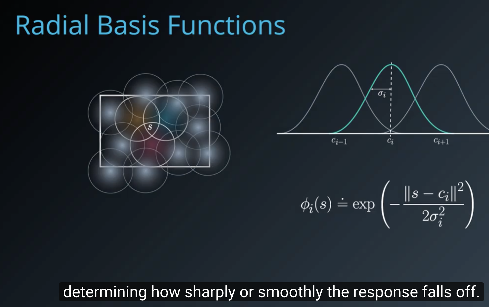

# RL in continuous space
## Two strategies:
- discretization
  - grid coding
  - Tile Coding
  - Coarse Coding
     radial basis function
- function approximation: Given a problem domain with continuous states s  , we wish to find a way to represent the value function v_π(s) or q_π(s, a). We can do this by choosing a parameterized function that approximates the true value function:
v^(s,w)≈v_π(s)
q^(s,a,w)≈q_π(s,a)

Our goal then reduces to finding a set of parameters w that yield an optimal value function. We can use the general reinforcement learning framework, with a Monte-Carlo or Temporal-Difference approach, and modify the update mechanism according to the chosen function.
  - linear function. feature is generic, can be represented by x(s) or x(s,a )
  - (Linear function with)kernel function. transform input state into  a different space.
    - e.g 
    - radial basis function:  
  - Non-Linear: what if value function is truly non-linear with respect to a combination of feature values.
