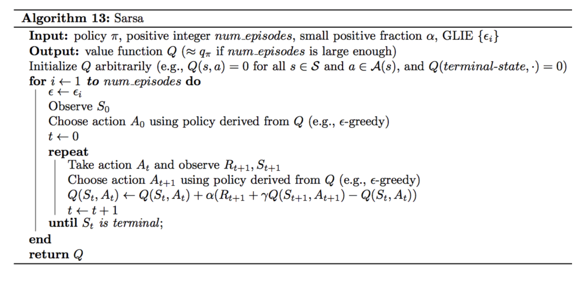
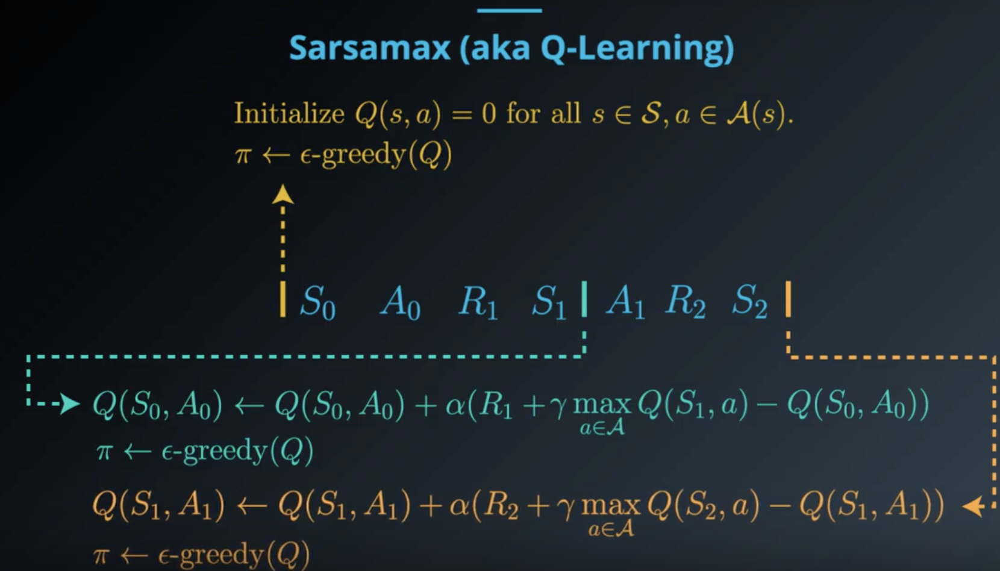
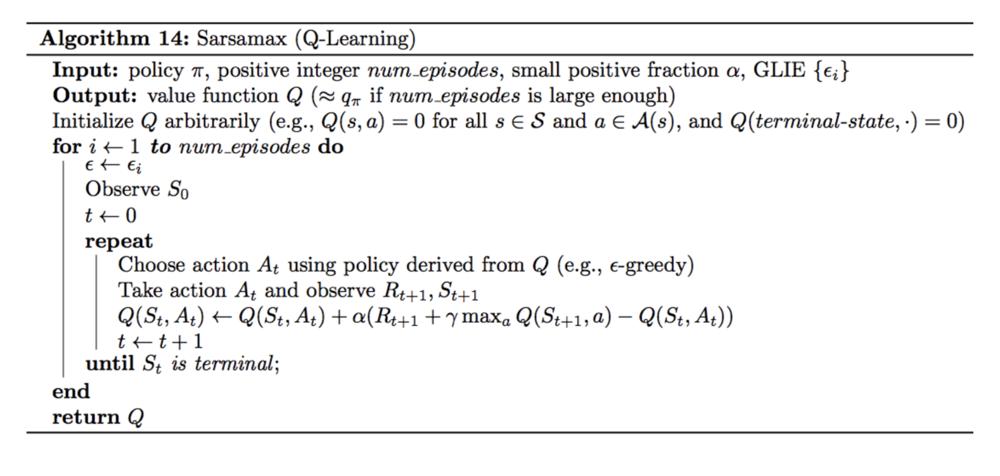
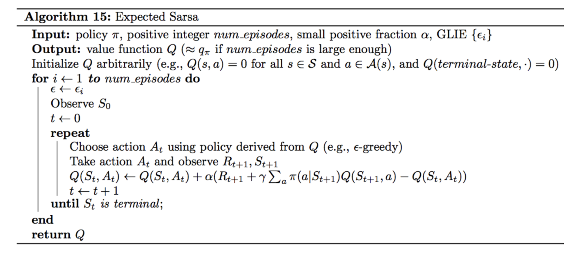
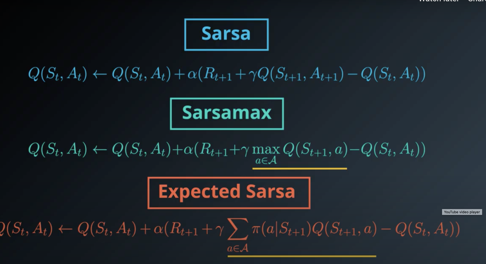
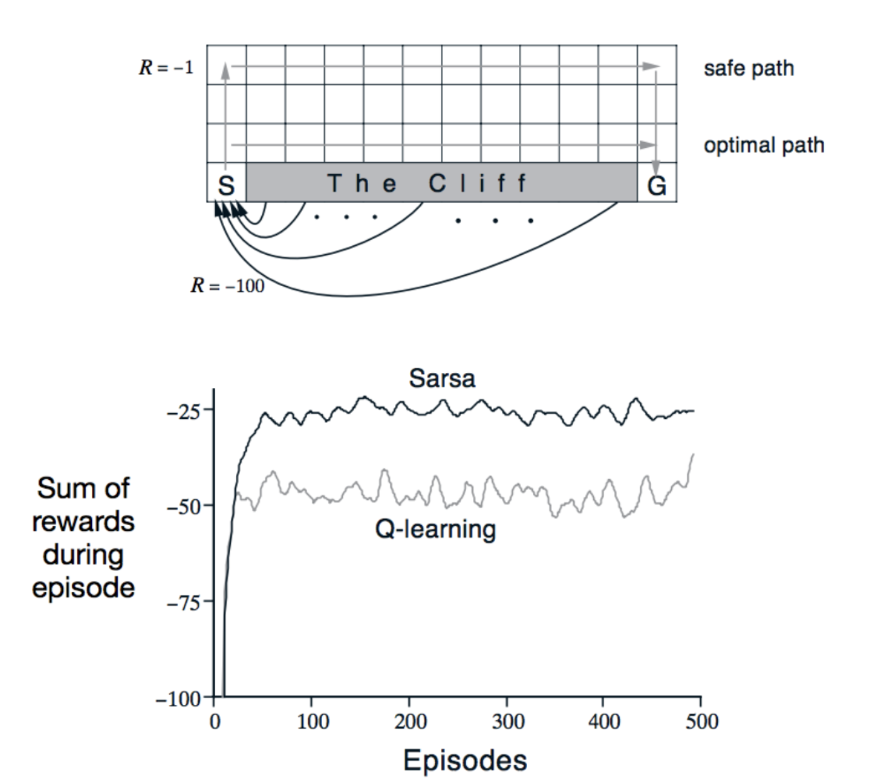
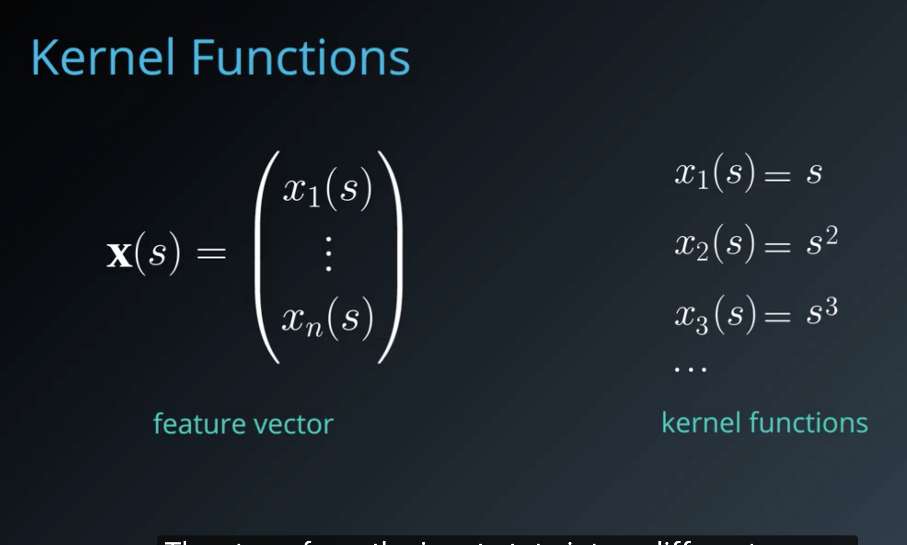
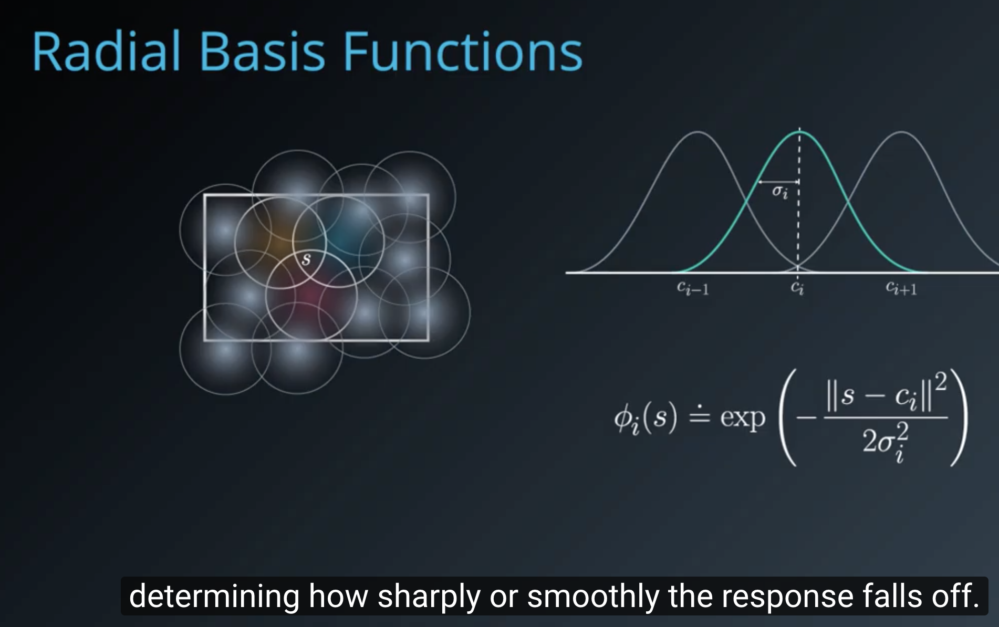
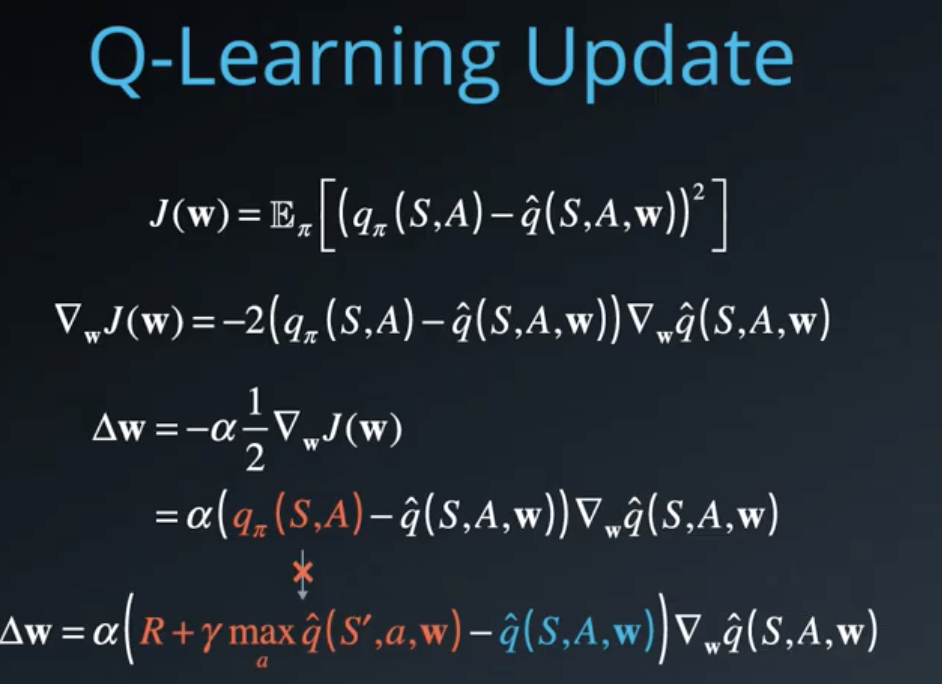

# TD Learning
MC update the estimate at every end of episode.
TD use an alternative target to update estimate at every time step.
## 1. Sarsa

evaluate epsilon-greedy policy

## 2. SarsaMax(Q-Learning)
S0, A0, R1, S1 ||
update the value estimate using greedy policy
S0, A0, R1, S1 || A1
Then choose the A1 still using epsilon-greedy policy with the action values just updated

evaluate greedy policy

[research paper-Technical Note Q,-Learning](http://www.gatsby.ucl.ac.uk/~dayan/papers/cjch.pdf) to read the proof that Q-Learning (or Sarsamax) converges.

sarsa evaluate whatever epsion-greedy policy that is currently being followed by the agent.

sarsamax directly attempts to approximate the optimal value function at every time step.

## 3. Expected Sarsa
read paper [A Theoretical and Empirical Analysis of Expected Sarsa](http://citeseerx.ist.psu.edu/viewdoc/download?doi=10.1.1.216.4144&rep=rep1&type=pdf) to learn more.

## Compare 3 sarsa together

# TD in practice
Greedy in the Limit with Infinite Exploration (GLIE)
The Greedy in the Limit with Infinite Exploration (GLIE) conditions were introduced in the previous lesson, when we learned about MC control. There are many ways to satisfy the GLIE conditions, all of which involve gradually decaying the value of \epsilonϵ when constructing \epsilonϵ-greedy policies.

In particular, let \epsilon_iϵ
i
​	  correspond to the ii-th time step. Then, to satisfy the GLIE conditions, we need only set \epsilon_iϵ
i
​	  such that:

\epsilon_i > 0ϵ
i
​	 >0 for all time steps ii, and
\epsilon_iϵ
i
​	  decays to zero in the limit as the time step ii approaches infinity (that is, \lim_{i\to\infty} \epsilon_i = 0lim
i→∞
​	 ϵ
i
​	 =0),
- In Theory
All of the TD control algorithms we have examined (Sarsa, Sarsamax, Expected Sarsa) are guaranteed to converge to the optimal action-value function q_*, as long as the step-size parameter \alphaα is sufficiently small, and the GLIE conditions are met.
- In practice, it is common to completely ignore the GLIE conditions and still recover an optimal policy. (You will see an example of this in the solution notebook.)
## Analyzing Performance
### Similarities
All of the TD control methods we have examined (Sarsa, Sarsamax, Expected Sarsa) converge to the optimal action-value function q_*q
∗
​	  (and so yield the optimal policy \pi_*π
∗
​	 ) if:

the value of \epsilonϵ decays in accordance with the GLIE conditions, and
the step-size parameter \alphaα is sufficiently small.
### Differences
The differences between these algorithms are summarized below:

- Sarsa and Expected Sarsa are both on-policy TD control algorithms. In this case, the same (\epsilonϵ-greedy) policy that is evaluated and improved is also used to select actions.
- Sarsamax is an off-policy method, where the (greedy) policy that is evaluated and improved is different from the (\epsilonϵ-greedy) policy that is used to select actions.
- On-policy TD control methods (like Expected Sarsa and Sarsa) have better online performance than off-policy TD control methods (like Sarsamax).
- Expected Sarsa generally achieves better performance than Sarsa.
If you would like to learn more, you are encouraged to read Chapter 6 of the textbook (especially sections 6.4-6.6).

The figure shows the performance of Sarsa and Q-learning on the cliff walking environment for constant \epsilon = 0.1ϵ=0.1. As described in the textbook, in this case,

Q-learning achieves worse online performance (where the agent collects less reward on average in each episode), but learns the optimal policy, and
Sarsa achieves better online performance, but learns a sub-optimal "safe" policy.

- summary
    - On-policy TD control methods (like Expected Sarsa and Sarsa) have better online performance than off-policy TD control methods (like Q-learning).
    - Expected Sarsa generally achieves better performance than Sarsa.

## Optimism
[Convergence of Optimistic and
Incremental Q-Learning](http://papers.nips.cc/paper/1944-convergence-of-optimistic-and-incremental-q-learning.pdf)

You have learned that for any TD control method, you must begin by initializing the values in the Q-table. It has been shown that initializing the estimates to large values can improve performance. For instance, if all of the possible rewards that can be received by the agent are negative, then initializing every estimate in the Q-table to zeros is a good technique. In this case, we refer to the initialized Q-table as optimistic, since the action-value estimates are guaranteed to be larger than the true action values.

# RL in continuous space
two strategies:
- discretization
  - grid coding
  - Tile Coding
  - Coarse Coding
     radial basis function
- function approximation: Given a problem domain with continuous states s  , we wish to find a way to represent the value function v_π(s) or q_π(s, a). We can do this by choosing a parameterized function that approximates the true value function:
v^(s,w)≈v_π(s)
q^(s,a,w)≈q_π(s,a)

Our goal then reduces to finding a set of parameters w that yield an optimal value function. We can use the general reinforcement learning framework, with a Monte-Carlo or Temporal-Difference approach, and modify the update mechanism according to the chosen function.
  - linear function. feature is generic, can be represented by x(s) or x(s,a )
  - (Linear function with)kernel function. transform input state into  a different space.
    - e.g 
    - radial basis function:  
  - Non-Linear: what if value function is truly non-linear with respect to a combination of feature values.

# Deep Q-Networks
the Deep Q-Learning algorithm represents the optimal action-value function q_* as a neural network (instead of a table)
## Stabilizing Deep Reinforcement Learning
[Issues in Using Function Approximation for Reinforcement Learning](http://citeseerx.ist.psu.edu/viewdoc/download?doi=10.1.1.73.3097&rep=rep1&type=pdf)

Unfortunately, reinforcement learning is notoriously unstable when neural networks are used to represent the action values. In this lesson, you'll learn all about the Deep Q-Learning algorithm, which addressed these instabilities by using two key features:
- Experience Replay
- Fixed Q-Targets

- Readings
  - Riedmiller, Martin. "Neural fitted Q iteration–first experiences with a data efficient neural reinforcement learning method." European Conference on Machine Learning. Springer, Berlin, Heidelberg, 2005. http://ml.informatik.uni-freiburg.de/former/_media/publications/rieecml05.pdf

  - Mnih, Volodymyr, et al. "Human-level control through deep reinforcement learning." Nature518.7540 (2015): 529. http://www.davidqiu.com:8888/research/nature14236.pdf
## DQN in Artari Paper
[Human-level control through deep reinforcement
learning](https://storage.googleapis.com/deepmind-media/dqn/DQNNaturePaper.pdf)
- In order to capture temporal information, a stack of 4 preprocessed frames are used as the state that is passed to the DQN.
- The DQN takes the state as input, and returns the corresponding predicted action values for each possible game action.
- The DQN architecture is composed of a couple of convolutional layers, followed by a couple of fully connected layers.
- For each Atari game, the DQN was trained from scratch on that game.

## Experience Replay
The replay buffer contains a collection of experience tuples (S, A, R, S'). The tuples are gradually added to the buffer as we are interacting with the environment.
  (what I understand is it break the online experience only, more like offline experience where more sampling techniques can be applied.)
- When the agent interacts with the environment, the sequence of experience tuples can be highly correlated. The naive Q-learning algorithm that learns from each of these experience tuples in sequential order runs the risk of getting swayed by the effects of this correlation. By instead keeping track of a replay buffer and using experience replay to sample from the buffer at random, we can prevent action values from oscillating or diverging catastrophically.
- In addition to breaking harmful correlations, experience replay allows us to learn more from individual tuples multiple times, recall rare occurrences, and in general make better use of our experience.
## Fixed Target
In Q-Learning, we update a guess with a guess, and this can potentially lead to harmful correlations. To avoid this, we can update the parameters ww in the network q^to better approximate the action value corresponding to state SS and action AA with the following update rule

- The Deep Q-Learning algorithm uses two separate networks with identical architectures.
- The target Q-Network's weights are updated less often (or more slowly) than the primary Q-Network.
- Without fixed Q-targets, we would encounter a harmful form of correlation, whereby we shift the parameters of the network based on a constantly moving target.
## Deep Q-Learning Algorithm
[ research paper that introduces the Deep Q-Learning algorithm.](https://storage.googleapis.com/deepmind-media/dqn/DQNNaturePaper.pdf)

[How to Read and Understand a Scientific Paper](https://www.huffpost.com/entry/how-to-read-and-understand-a-scientific-paper_b_5501628)

[How to read and understand a scientific paper: a guide for non-scientists](https://violentmetaphors.com/2013/08/25/how-to-read-and-understand-a-scientific-paper-2/)
- Take notes.

- Read the paper multiple times. On the first couple readings, try to focus on the main points:

  - What kind of tasks are the authors using deep reinforcement learning (RL) to solve? What are the states, actions, and rewards?
  - What neural network architecture is used to approximate the action-value function?
  - How are experience replay and fixed Q-targets used to stabilize the learning algorithm?
  - What are the results?
- Understanding the paper will probably take you longer than you think. Be patient, and reach out to the Udacity community with any questions.

## [Double Q-Learning](https://arxiv.org/abs/1509.06461)
[Issues in Using Function Approximation for Reinforcement Learning](https://www.ri.cmu.edu/pub_files/pub1/thrun_sebastian_1993_1/thrun_sebastian_1993_1.pdf)

Deep Q-Learning tends to overestimate action values. Double Q-Learning has been shown to work well in practice to help with this.

## [Prioritized Experience Replay](https://arxiv.org/abs/1511.05952)
Deep Q-Learning samples experience transitions uniformly from a replay memory. Prioritized experienced replay is based on the idea that the agent can learn more effectively from some transitions than from others, and the more important transitions should be sampled with higher probability.

## Dueling DQN
[Dueling Network Architectures for Deep Reinforcement Learning](https://arxiv.org/abs/1511.06581)
Currently, in order to determine which states are (or are not) valuable, we have to estimate the corresponding action values for each action. However, by replacing the traditional Deep Q-Network (DQN) architecture with a dueling architecture, we can assess the value of each state, without having to learn the effect of each action.
