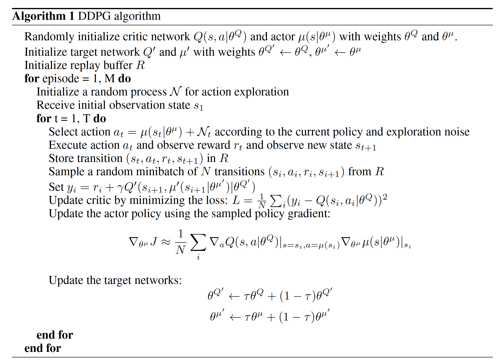
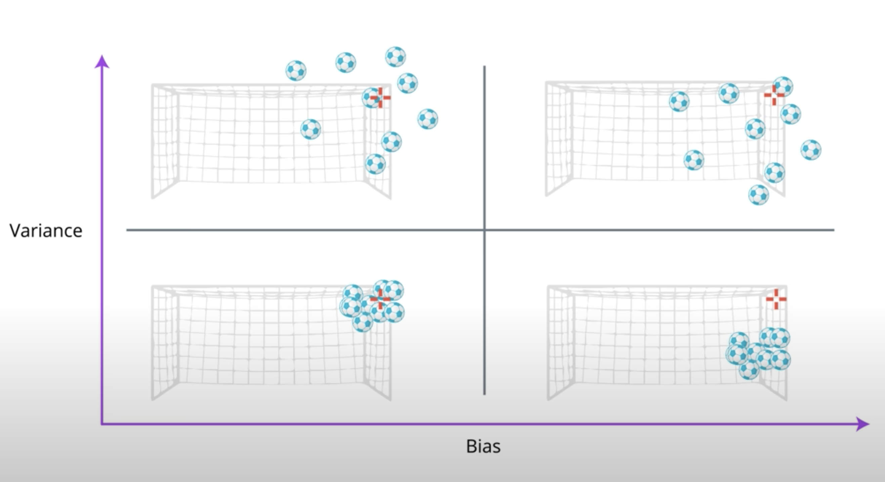
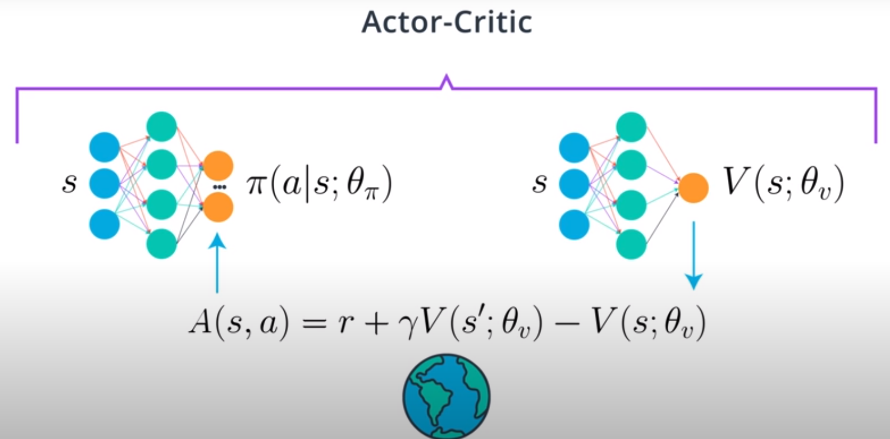
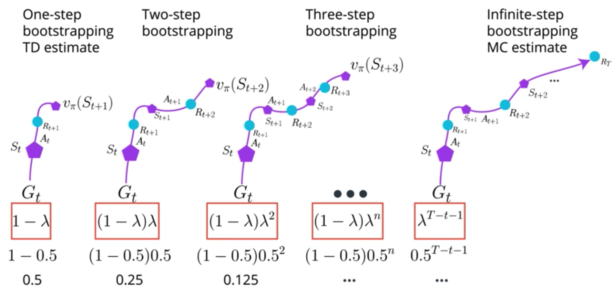

https://theaisummer.com/Actor_critics/

The principal idea is to split the model in two: one for computing an action based on a state and another one to produce the Q values of the action.

- The actor takes as input the state and outputs the best action. It essentially controls how the agent behaves by learning the optimal policy (policy-based).
- The critic, on the other hand, evaluates the action by computing the value function (value based). Those two models participate in a game where they both get better in their own role as the time passes. The result is that the overall architecture will learn to play the game more efficiently than the two methods separately.

The actor can be a function approximator like a neural network and its task is to produce the best action for a given state. Of course, it can be a fully connected neural network or a convolutional or anything else. The critic is another function approximator, which receives as input the environment and the action by the actor, concatenates them and output the action value (Q-value) for the given pair. Let me remind you for a sec that the **Q value is essentially the maximum future reward**.

As time passes, the actor is learning to produce better and better actions (he is starting to learn the policy) and the critic is getting better and better at evaluating those actions. It is important to notice that the **update of the weights happen at each step (TD Learning) and not at the end of the episode, opposed to policy gradients**.

# Paper
The following use multiple (non-interacting, parallel) copies of the same agent to distribute the task of gathering experience.
- A3C [Asynchronous Methods for Deep Reinforcement Learning](https://arxiv.org/pdf/1602.01783.pdf)
- D4PG [DISTRIBUTED DISTRIBUTIONAL DETERMINISTIC POLICY GRADIENTS](https://openreview.net/pdf?id=SyZipzbCb)
- DDPG [Continuous control with deep reinforcement learning](https://arxiv.org/abs/1509.02971)
- PPO [Proximal Policy Optimization Algorithms](https://arxiv.org/pdf/1707.06347.pdf)

- [Benchmarking Deep Reinforcement Learning for Continuous Control](https://arxiv.org/abs/1604.06778)
- [Deterministic policy gradient algorithms](http://proceedings.mlr.press/v32/silver14.pdf)

## DPG [Paper-Deterministic policy gradient algorithms](http://proceedings.mlr.press/v32/silver14.pdf)
- Policy gradient: The basic idea is to represent the policy by a parametric probability
distribution (ajs) = P [ajs; ] that stochastically selects action a in state s according to parameter vector . Policy gradient algorithms typically proceed by sampling
this stochastic policy and adjusting the policy parameters in the direction of greater cumulative reward.
  - In this paper we instead consider deterministic policies.
- From a practical viewpoint, there is a crucial difference between
the stochastic and deterministic policy gradients. In the stochastic case, the policy gradient integrates over both state and action spaces, whereas in the deterministic case it
only integrates over the state space. As a result, computing the stochastic policy gradient may require more samples, especially if the action space has many dimensions.
  - In order to explore the full state and action space, a stochastic
policy is often necessary. To ensure our deterministic
policy gradient algorithms continue to explore satisfactorily, we introduce an off-policy learning algorithm. The basic idea is to choose actions according to a stochastic
behaviour policy (to ensure adequate exploration), but to learn about a deterministic target policy (exploiting the efficiency
of the deterministic policy gradient).

- actor-critic: The actor-critic consists of two eponymous components. An actor
adjusts the parameters  of the stochastic policy (s) by stochastic gradient ascent of Equation 2. Instead of the unknown true action-value function Q(s; a) , an action-value function Qw(s; a) is used, with parameter vector w. A critic estimates the action-value function
Qw(s; a)  Q(s; a) using an appropriate policy evaluation
algorithm such as temporal-difference learning.

## DDPG Paper (Deep deterministic policy gradient (DPG))
- while DQN solves problems with high-dimensional observation spaces, it can only handle
discrete and low-dimensional action spaces. Many tasks of interest, most notably physical control
tasks, have continuous (real valued) and high dimensional action spaces. DQN cannot be straightforwardly
applied to continuous domains since it relies on a finding the action that maximizes the
action-value function, which in the continuous valued case requires an iterative optimization process
at every step. It is not possible to straightforwardly apply Q-learning to continuous action spaces, because in continuous
spaces finding the greedy policy requires an optimization of at at every timestep; this optimization
is too slow to be practical with large, unconstrained function approximators and nontrivial
action spaces.
  - An obvious approach to adapting deep reinforcement learning methods such as DQN to continuous
domains is to to simply discretize the action space. However, this has many limitations, most notably
the curse of dimensionality: the number of actions increases exponentially with the number
of degrees of freedom. Additionally, naive discretization of action
spaces needlessly throws away information about the structure of the action domain, which may be
essential for solving many problems.
- DDPG uses:
  1. replay buffer
  2. target network
  3. batch normalization - [Batch normalization: Accelerating deep network training by
reducing internal covariate shift](https://arxiv.org/abs/1502.03167)
- DPG: The DPG algorithm maintains a parameterized actor function (sj) which specifies the current
policy by deterministically mapping states to a specific action. The critic Q(s; a) is learned using
the Bellman equation as in Q-learning.

- When learning from low dimensional feature vector observations, the different components of the
observation may have different physical units (for example, positions versus velocities) and the
ranges may vary across environments. This can make it difficult for the network to learn effectively
and may make it difficult to find hyper-parameters which generalise across environments with
different scales of state values.
  - One approach to this problem is to manually scale the features so they are in similar ranges across environments and units. We address this issue by adapting a recent technique from deep learning called batch normalization [Batch Normalization: Accelerating Deep Network Training by
Reducing Internal Covariate Shift]. This technique normalizes each dimension
across the samples in a minibatch to have unit mean and variance. In addition, it maintains a running
average of the mean and variance to use for normalization during testing (in our case, during
exploration or evaluation). In deep networks, it is used to minimize covariance shift during training, by ensuring that each layer receives whitened input.

- A major challenge of learning in continuous action spaces is exploration. An advantage of offpolicies algorithms such as DDPG is that we can treat the problem of exploration independently
from the learning algorithm. We constructed an exploration policy 0 by adding noise sampled from
a noise process N to our actor policy

# Actor Critic
There are several types of RL algorithms, and they can be divided into three groups:

- **Critic-Only**: Critic-Only methods, also known as Value-Based methods, first find the optimal value function and then derive an optimal policy from it.

- **Actor-Only**: Actor-Only methods, also known as Policy-Based methods, search directly for the optimal policy in policy space. This is typically done by using a parameterized family of policies over which optimization procedures can be used directly.

- **Actor-Critic**: Actor-Critic methods combine the advantages of actor-only and critic-only methods. In this method, the critic learns the value function and uses it to determine how the actor's policy parramerters should be changed. In this case, the actor brings the advantage of computing continuous actions without the need for optimization procedures on a value function, while the critic supplies the actor with knowledge of the performance. Actor-critic methods usually have good convergence properties, in contrast to critic-only methods.  The **Deep Deterministic Policy Gradients (DDPG)** algorithm is one example of an actor-critic method.

## bias and variance

when RL tries to estimation value from return, a return is calculated using a single trajectory, but value functions  whcih is what to estimate is calculated using the expectation of returns.

RL agent find policies that maximize the total expected reward, but since we are limited to sampling the environment, we can only estimate the expectation
- MC is high variance & unbiased: because it is compouding lots of random events that happend during the course of a single epsidoe. unbiased because it is not estimation using an estimate. you are only using the true rewards obtained. SO given lots of data, estimate will be accurate.
- TD is low variance because you are only compounding a single time step of randomness instead of a full rollout. Though because of bootstraping the next state estimates and those are not true values, you are addig bias, agent learn faster but more problems in converging.

## A3C Asynchronous Advantage Actor-Critic
- use Parallel Training to decouple sample correlation.  multiple instances of env and agent and running them all at same time, samples will be decorrelated but agent would experiemce different states at any given time
- Off-policy vs. On-policy: read more in [paper-Q-Prop: Sample-Efficient Policy Gradient with An Off-Policy Critic](https://arxiv.org/abs/1611.02247)
  - on policy: the policy used for interacting with the environment is also the policy being learned.
  sara use same policy interacting while learning. Q-learning learns the optimal pocliy but interacting with exploraty(epsilon-greedy) policy.
    - Q-learning learns the deterministic optimal policy, even if its behavior policy is totally random. Sara learns the best exploratory policy , that is the best policy that still explores.
- off policy: agenets can learn from many different sources including experiences  (replay buffer). But it is not stable and often diverge.
A3C (on-policy) every time you improve the policy, you toss out old data and collect new. It is a bit inefficient in the use of experiences, but has more stable and consistent convergence propoerties

## A2C: Advantage Actor-Critic (synchronous)
A2C code implementation: https://github.com/ShangtongZhang/DeepRL

## GAE Generalized advantage estimation
- how to choose n in n-step bootstrapping, lambda return:

- GAE paper : [High-Dimensional Continuous Control Using Generalized Advantage Estimation](https://arxiv.org/abs/1506.02438)

## DDPG: Deep Deterministic Policy Gradient, Continuous Action-space
- Problem with DQN is not straightforward to use in continous action space.
    - DDPG has two networks , one actor one critic. The actor is used to approximate the optimal policy deterministically. We always want to output the best believed action for any given state. Actor is learning best action for argmaxQ(s,a). The critic learns to evaluate the optimal action value function by using actor's best believed action.
- In the DDPG paper - [Continuous control with deep reinforcement learning](https://arxiv.org/abs/1509.02971), they introduced this algorithm as an "Actor-Critic" method. Though, some researchers think DDPG is best classified as a DQN method for continuous action spaces (along with NAF -[Continuous Deep Q-Learning with Model-based Acceleration](https://arxiv.org/abs/1603.00748)).
- Soft Updates: in DQN, two networks, regular and target network. Target network is fixed for 10,000 time steps and then get a big update(copied from regular network weights). in DDPG, every step, mix in 0.01% of regular network weights with target network weights. This soft updates get faster convergence.
