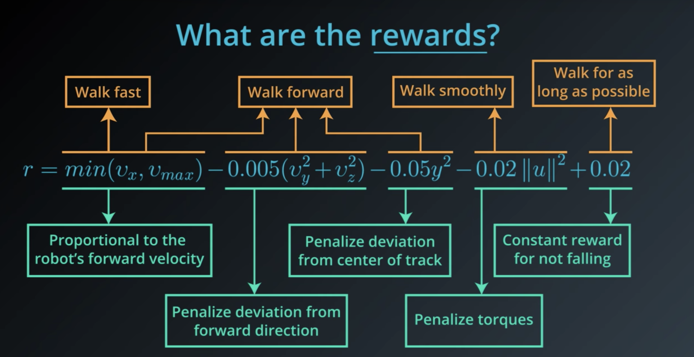

# 6. The Rl Framework: The problem
- Continuing tasks are tasks that continue forever, without end., e.g stock exchange where continuing buying and selling happens
- Episodic tasks are tasks with a well-defined starting and ending point. interaction ends at some time step
  - In this case, we refer to a complete sequence of interaction, from start to finish, as an episode.
  - Episodic tasks come to an end whenever the agent reaches a terminal state.

## Playing Chess
Say you are an agent, and your goal is to play chess. At every time step, you choose any action from the set of possible moves in the game. Your opponent is part of the environment; she responds with her own move, and the state you receive at the next time step is the configuration of the board, when it’s your turn to choose a move again. The reward is only delivered at the end of the game, and, let’s say, is +1 if you win, and -1 if you lose.

This is an episodic task, where an episode finishes when the game ends. The idea is that by playing the game many times, or by interacting with the environment in many episodes, you can learn to play chess better and better.

It's important to note that this problem is exceptionally difficult, because the feedback is only delivered at the very end of the game. So, if you lose a game (and get a reward of -1 at the end of the episode), it’s unclear when exactly you went wrong: maybe you were so bad at playing that every move was horrible, or maybe instead … you played beautifully for the majority of the game, and then made only a small mistake at the end.

When the reward signal is largely uninformative in this way, we say that the task suffers the problem of sparse rewards. There’s an entire area of research dedicated to this problem, and you’re encouraged to read more about it, if it interests you.
- In chess, what's an example of an action that the agent could take? Moving a piece
- What's an example of a state in the game? configuration of the board.

## Robot
- what are the states?
  - the position and velocity of the joints
  - measurements/stats of the ground
  - contact sensor data, e.g foot sensor
- actions: forces applied to the joints
- [Deepmind Producing flexible behaviours in simulated environments](https://deepmind.com/blog/article/producing-flexible-behaviours-simulated-environments)
- [Paper Emergence of Locomotion Behaviours in Rich Environments](https://arxiv.org/pdf/1707.02286.pdf)

8. goals & reward part 2:

