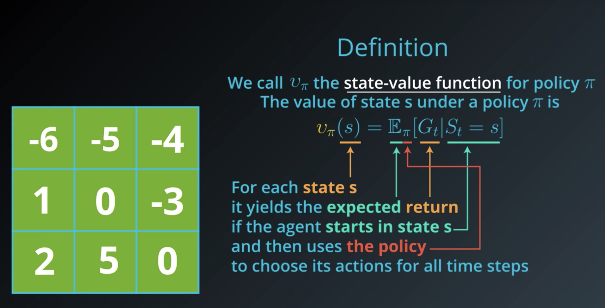
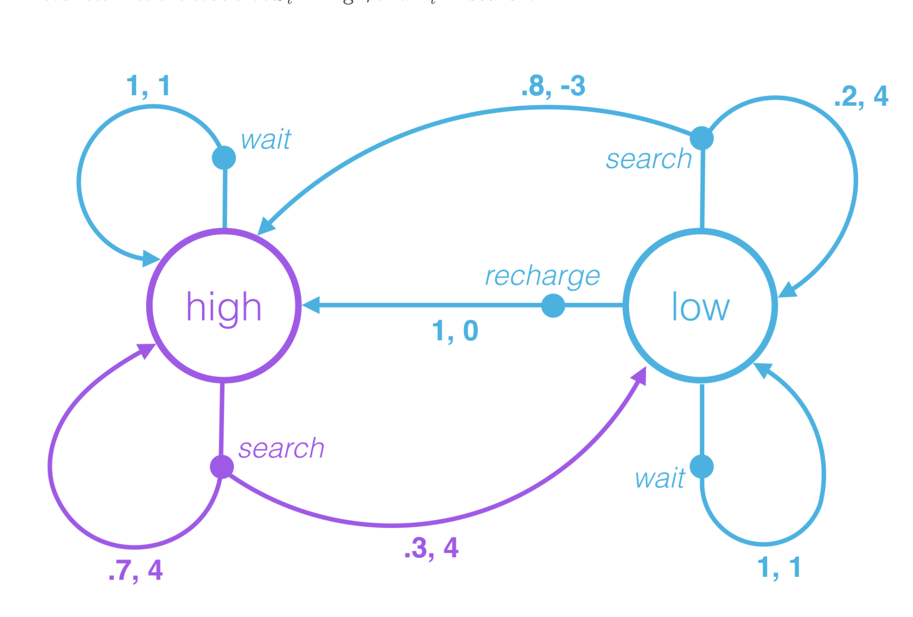
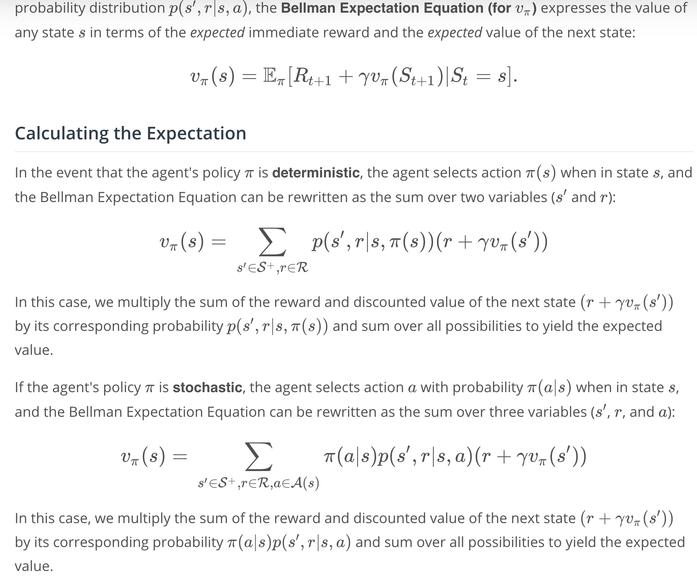
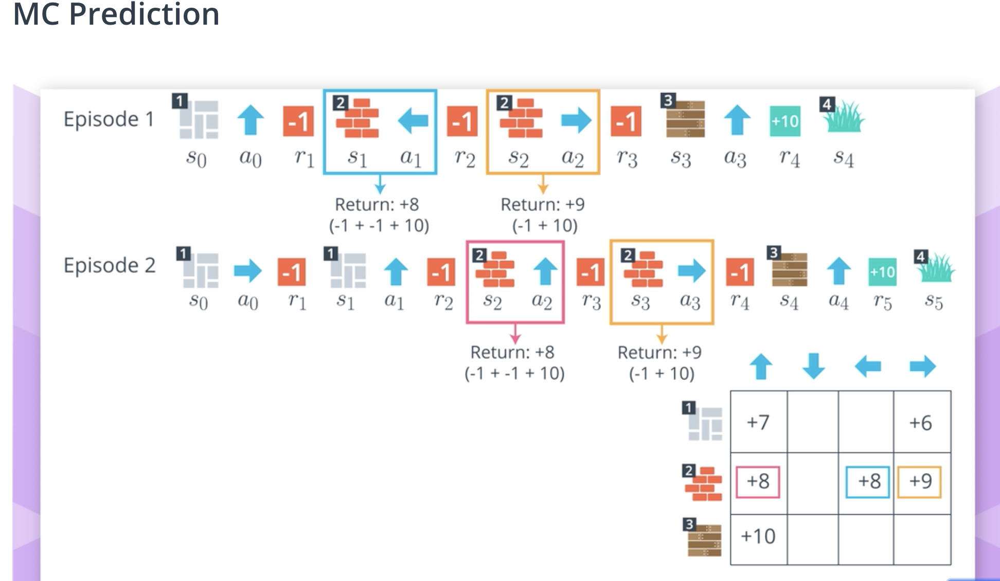
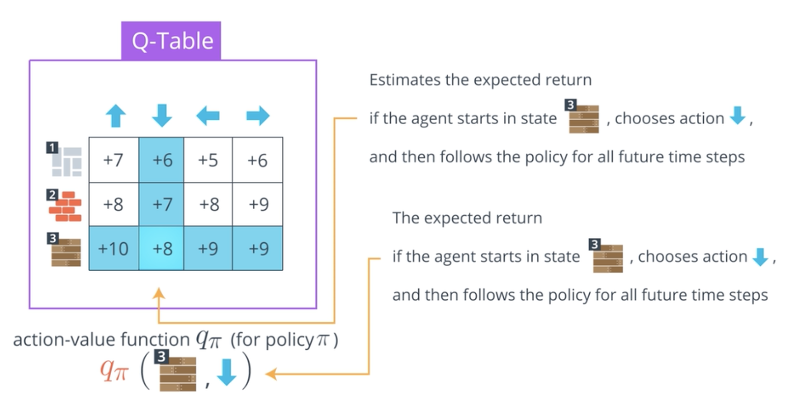
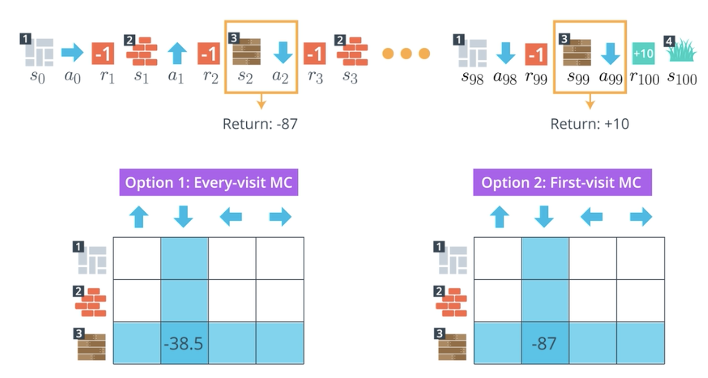

# 6. The Rl Framework: The problem
- Continuing tasks are tasks that continue forever, without end., e.g stock exchange where continuing buying and selling happens
- Episodic tasks are tasks with a well-defined starting and ending point. interaction ends at some time step
  - In this case, we refer to a complete sequence of interaction, from start to finish, as an episode.
  - Episodic tasks come to an end whenever the agent reaches a terminal state.

## Playing Chess
Say you are an agent, and your goal is to play chess. At every time step, you choose any action from the set of possible moves in the game. Your opponent is part of the environment; she responds with her own move, and the state you receive at the next time step is the configuration of the board, when it’s your turn to choose a move again. The reward is only delivered at the end of the game, and, let’s say, is +1 if you win, and -1 if you lose.

This is an episodic task, where an episode finishes when the game ends. The idea is that by playing the game many times, or by interacting with the environment in many episodes, you can learn to play chess better and better.

It's important to note that this problem is exceptionally difficult, because the feedback is only delivered at the very end of the game. So, if you lose a game (and get a reward of -1 at the end of the episode), it’s unclear when exactly you went wrong: maybe you were so bad at playing that every move was horrible, or maybe instead … you played beautifully for the majority of the game, and then made only a small mistake at the end.

When the reward signal is largely uninformative in this way, we say that the task suffers the problem of sparse rewards. There’s an entire area of research dedicated to this problem, and you’re encouraged to read more about it, if it interests you.
- In chess, what's an example of an action that the agent could take? Moving a piece
- What's an example of a state in the game? configuration of the board.

## Robot
- what are the states?
  - the position and velocity of the joints
  - measurements/stats of the ground
  - contact sensor data, e.g foot sensor
- actions: forces applied to the joints
- [Deepmind Producing flexible behaviours in simulated environments](https://deepmind.com/blog/article/producing-flexible-behaviours-simulated-environments)
- [Paper Emergence of Locomotion Behaviours in Rich Environments](https://arxiv.org/pdf/1707.02286.pdf)

8. goals & reward part 2:

## Cumulative Reward
actions have short and long term consequences, maximize immediate reward may lead to less cumulative reward. Agent needs to gain some understanding of the complex effects its action have on the enviroment.
- Test you reward intuition with 12. Quiz Pole Balancing
  - the key to think is comparing proceed to terminate, which action has higher value. Similar to Q(proceed) vs Q(drop). Given the expected cumulative reward at this time step.
## MDP
When the environment responds to the agent at time step t+1t+1, it considers only the state and action at the previous time step (S_t, A_t)
- In particular, it does not care what state was presented to the agent more than one step prior. (In other words, the environment does not consider any { S_0, ,,, S_(t-1)}

- And, it does not look at the actions that the agent took prior to the last one. (In other words, the environment does not consider any of { A_0, ,,, A_(t-1)}

### Finite MDPs
Recall from the previous concept that in a finite MDP, the state space S (or S+, in the case of an episodic task) and action space \mathcal{A}A must both be finite.

Thus, while the CartPole-v0 environment does specify an MDP, it does not specify a finite MDP. In this course, we will first learn how to solve finite MDPs. Then, later in this course, you will learn how to use neural networks to solve much more complex MDPs!
- Definition
  - a (finite) set of states S (or S+, in the case of an episodic task)
 - a (finite) set of actions A
 - a set of rewards R
 - the one-step dynamics of the environment
 - the discount rate γ∈[0,1]
## Frame a RL problem
1. describe in plain sentence what you want the agent to achieve
2. what are the actions? define action space
3. what are the states? define state space. State are the context provided to the agent to make intelligent action.
4. how to design the rewards to achieve #1. How to leverage gamma to balance shot-term and long-term reward

- The reinforcement learning (RL) framework is characterized by an agent learning to interact with its environment.
- At each time step, the agent receives the environment's state (the environment presents a situation to the agent), and the agent must choose an appropriate action in response. One time step later, the agent receives a reward (the environment indicates whether the agent has responded appropriately to the state) and a new state.
- All agents have the goal to maximize expected cumulative reward, or the expected sum of rewards attained over all time steps.
  - The agent selects actions with the goal of maximizing expected (discounted) return
  - The discounted return at time step t is: G_t = R_t+1 + ...

# Policy
A policy determines how an agent chooses an action in response to the current state. In other words, it specifies how the agent responds to situations that the environment has presented.
- deterministic policy
- stochastic policy: probability that agent takes action a in state s.
$$\pi(a|s) = p(A_t=a| S_t=s)$$

Now the question is how the agent can find the best policy?
A policy 'π′ is defined to be better than or equal to a policy π if and only if v_{\pi'}(s) >= v_\pi(s)v for all states s
An optimal policy \pi_*π
∗
​	  satisfies \pi_* \geq \piπ
∗
​	 ≥π for all policies \piπ. An optimal policy is guaranteed to exist but may not be unique.

Once the agent determines the optimal action-value function, it can quickly obtain an optimal policy by setting action to be argmax.
# State Value function

# Action Value Function
for each state and action, the action value function yields the expected return, if the agent starts in that state, takes the action, and **then follows the policy** for all future time steps.
# Bellman Equations
for a general MDP, we have to instead work in terms of an expectation, since it's not often the case that the immediate reward and next state can be predicted with certainty.
Bellman Expectation Equation (for v_\piv π)

How to calculate expectation?

**There are a total of 4 Bellman equations.** All of the Bellman equations attest to the fact that value functions satisfy recursive relationships.  the Bellman Expectation Equation (for v_π) shows that it is possible to relate the value of a state to the values of all of its possible successor states.
After finishing this lesson, you are encouraged to read about the remaining three Bellman equations in sections 3.5 and 3.6 of the textbook.

# Monte Carlo Prediction
 the agent can take a bad policy, like the equiprobable random policy, use it to collect some episodes, and then consolidate the results to arrive at a better policy.
 Prediction Problem: Given a policy, how might the agent estimate the value function for that policy?

## Q Table
The Q-table is used to estimate the action-value function.

## First-Visit vs Every-Visit MC
Problem: in a single episode - the same action is selected from the same state many times

- Both the first-visit and every-visit method are guaranteed to converge to the true action-value function, as the number of visits to each state-action pair approaches infinity. (So, in other words, as long as the agent gets enough experience with each state-action pair, the value function estimate will be pretty close to the true value.) In the case of first-visit MC, convergence follows from the Law of Large Numbers, and the details are covered in section 5.1 of the textbook.
- If you are interested in learning more about the difference between first-visit and every-visit MC methods, you are encouraged to read Section 3 of this paper- [Reinforcement Learning with Replacing Eligibility Traces
](http://www-anw.cs.umass.edu/legacy/pubs/1995_96/singh_s_ML96.pdf). The results are summarized in Section 3.6. The authors show:
- Every-visit MC is [biased](https://en.wikipedia.org/wiki/Bias_of_an_estimator), whereas first-visit MC is unbiased (see Theorems 6 and 7).
- Initially, every-visit MC has lower mean squared error (MSE), but as more episodes are collected, first-visit MC attains better MSE (see Corollary 9a and 10a, and Figure 4).
